# Rapport d'Analyse Statique — UnCrackable Level 1

## Informations générales
- **Date d'analyse :** 03/05/2026
- **Analyste :** Hiba Sidinou
- **APK analysé :** UnCrackable-Level1.apk
- **Version :** 1.0 (versionCode: 1)
- **Provenance :** OWASP MSTG Crackmes — https://mas.owasp.org/crackmes/Android/
- **Outils utilisés :** JADX GUI v1.5.5, dex2jar v2.4, JD-GUI v1.6.6

---

## Résumé exécutif

Cette analyse statique a révélé **5 vulnérabilités potentielles** dans l'application UnCrackable Level 1.  
Les principales préoccupations concernent une **clé AES codée en dur**, un **algorithme de chiffrement faible (AES/ECB)**, et une **politique de backup non restreinte**.  
Le niveau de risque global est évalué comme **ÉLEVÉ**.

Actions prioritaires recommandées :
1. Ne jamais stocker de secrets cryptographiques dans le code source
2. Remplacer AES/ECB par AES/GCM (avec IV aléatoire)
3. Désactiver `android:allowBackup` en production

---

## Task 1 — Environnement de travail

### 1.1 — Dossier de travail créé

**Commandes :**
```
PS C:\> mkdir C:\APK-Analysis
PS C:\> cd C:\APK-Analysis
PS C:\APK-Analysis> Copy-Item "C:\Users\user\Downloads\UnCrackable-Level1(1).apk.zip" "C:\APK-Analysis\UnCrackable-Level1.apk"
```
✅ Dossier de travail créé et APK copié.

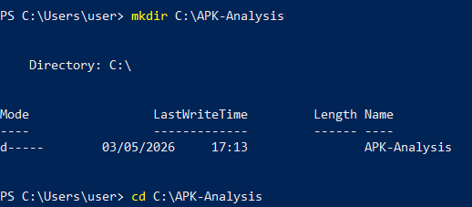

---

### 1.2 — Vérification Magic Bytes (format ZIP/APK valide)

**Commande :**
```
PS C:\APK-Analysis> Format-Hex "C:\APK-Analysis\UnCrackable-Level1.apk" | Select-Object -First 1
```
**Résultat :**
```
           Path: C:\APK-Analysis\UnCrackable-Level1.apk
           00 01 02 03 04 05 06 07 08 09 0A 0B 0C 0D 0E 0F
00000000   50 4B 03 04 00 00 00 00 08 00 00 00 00 00 59 D0  PK............YÐ
```
✅ Magic bytes `50 4B` = `PK` → APK valide (format ZIP).

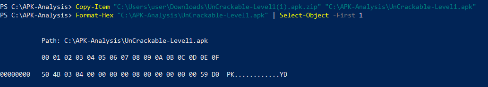

---

### 1.3 — Hash SHA-256 (traçabilité)

**Commande :**
```
PS C:\APK-Analysis> Get-FileHash -Algorithm SHA256 "C:\APK-Analysis\UnCrackable-Level1.apk"
```
**Résultat :**
```
Algorithm  Hash                                                              Path
---------  ----                                                              ----
SHA256     1DA8BF57D266109F9A07C01BF7111A1975CE01F190B9D914BCD3AE3DBEF96F21  UnCrackable-Level1.apk
```
✅ Hash SHA-256 noté pour traçabilité et vérification d'intégrité.

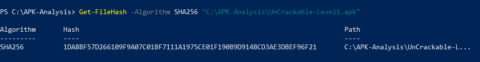

---

### 1.4 — Structure de l'APK

**Commande :**
```
PS C:\APK-Analysis> [System.IO.Compression.ZipFile]::OpenRead("C:\APK-Analysis\UnCrackable-Level1.apk").Entries | Select-Object -ExpandProperty FullName -First 20
```
**Résultat :**
```
AndroidManifest.xml
META-INF/CERT.RSA
META-INF/CERT.SF
META-INF/MANIFEST.MF
classes.dex
res/layout/activity_main.xml
res/menu/menu_main.xml
res/mipmap-hdpi-v4/ic_launcher.png
res/mipmap-mdpi-v4/ic_launcher.png
res/mipmap-xhdpi-v4/ic_launcher.png
res/mipmap-xxhdpi-v4/ic_launcher.png
res/mipmap-xxxhdpi-v4/ic_launcher.png
resources.arsc
```
✅ Structure identifiée : 1 fichier DEX, manifeste, ressources, certificats.


---

## Task 2 — APK Source

- **Provenance :** OWASP MSTG Crackmes (https://mas.owasp.org/crackmes/Android/)
- **Taille :** 901 022 octets (~880 KB)
- **Type :** APK de démonstration pédagogique (non production)

---

## Task 3 — Analyse avec JADX GUI

### 3.1 — AndroidManifest.xml

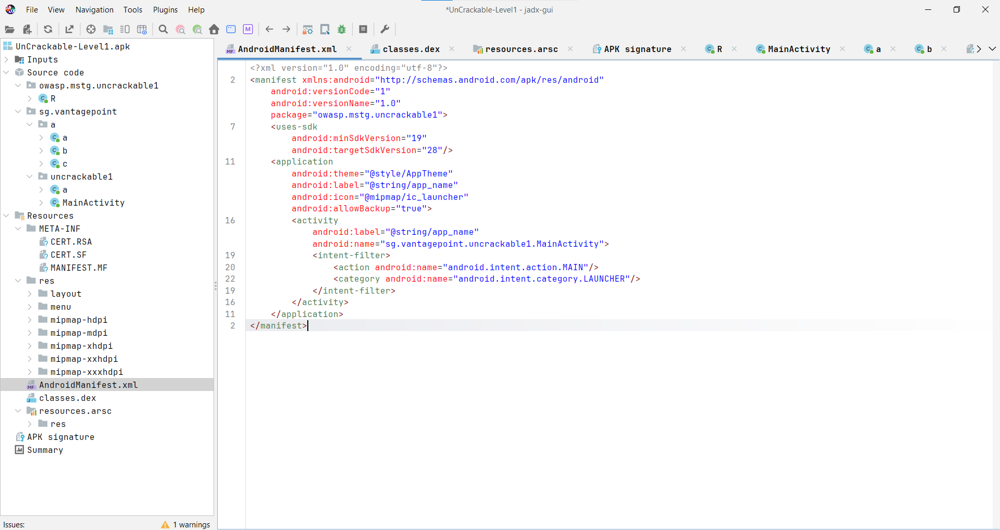

**Contenu analysé :**
```xml
<manifest package="owasp.mstg.uncrackable1"
    android:versionCode="1"
    android:versionName="1.0">
    <uses-sdk
        android:minSdkVersion="19"
        android:targetSdkVersion="28"/>
    <application
        android:allowBackup="true"
        android:label="@string/app_name">
        <activity android:name="sg.vantagepoint.uncrackable1.MainActivity">
            <intent-filter>
                <action android:name="android.intent.action.MAIN"/>
                <category android:name="android.intent.category.LAUNCHER"/>
            </intent-filter>
        </activity>
    </application>
</manifest>
```

| Champ | Valeur | Observation |
|-------|--------|-------------|
| Package | `owasp.mstg.uncrackable1` | — |
| versionName | `1.0` | — |
| minSdkVersion | `19` (Android 4.4) | ⚠️ Très ancien |
| targetSdkVersion | `28` (Android 9) | ⚠️ Non à jour |
| allowBackup | `true` | 🔴 Risque élevé |
| debuggable | absent (false) | ✅ OK |
| usesCleartextTraffic | absent | ✅ OK |
| Permissions | **aucune** | ✅ OK |
| Composants exportés | MainActivity (intent-filter MAIN) | ⚠️ Normal launcher |

---

### 3.2 — strings.xml

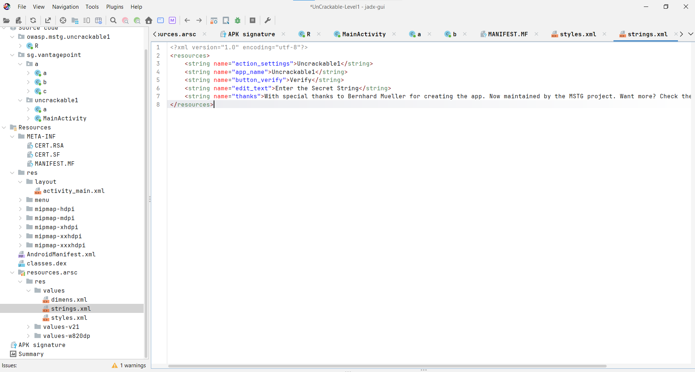

```xml
<string name="app_name">Uncrackable1</string>
<string name="button_verify">Verify</string>
<string name="edit_text">Enter the Secret String</string>
<string name="action_settings">Uncrackable1</string>
```
✅ Aucune donnée sensible dans strings.xml.

---

### 3.3 — Code source — Classes identifiées

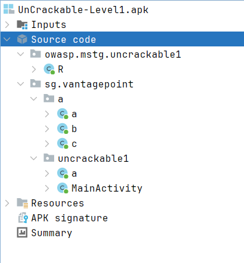

| Classe | Rôle |
|--------|------|
| `sg.vantagepoint.a.a` | Déchiffrement AES |
| `sg.vantagepoint.a.b` | Détection mode debug |
| `sg.vantagepoint.a.c` | Détection root (3 méthodes) |
| `sg.vantagepoint.uncrackable1.MainActivity` | Activité principale + vérification |
| `sg.vantagepoint.uncrackable1.a` | Logique de vérification du secret |

---

## Task 4 — Recherche de chaînes sensibles

### 4.1 — Recherche "http"

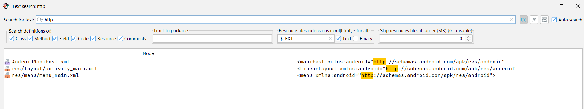

**Résultat :** Uniquement des namespaces Android standards (`http://schemas.android.com/apk/res/android`).  
**Niveau de risque :** ✅ Faible — pas d'URL HTTP en clair dans le code applicatif.

---

### 4.2 — Recherche "secret"

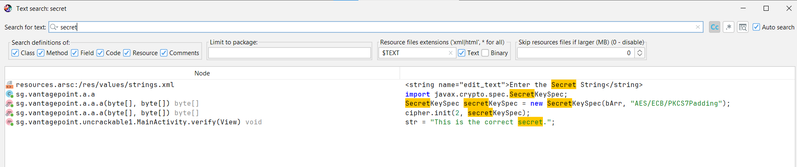

**Résultats trouvés :**
- `strings.xml` → `"Enter the Secret String"` (UI label)
- `sg.vantagepoint.a.a` → `SecretKeySpec` (clé AES)
- `sg.vantagepoint.uncrackable1.MainActivity` → `"This is the correct secret."`

**Niveau de risque :** 🔴 Élevé — confirmation d'une clé secrète utilisée dans le code.

---

### 4.3 — Recherche "key"

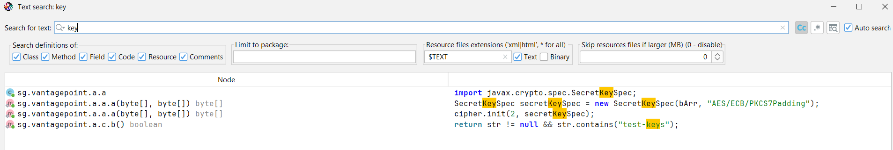

**Résultats trouvés :**
- `SecretKeySpec` utilisé dans `sg.vantagepoint.a.a`
- `"test-keys"` dans `sg.vantagepoint.a.c.b()` (détection root via Build.TAGS)

**Niveau de risque :** 🔴 Élevé — clé AES hardcodée confirmée.

---

### 4.4 — Recherche "password"

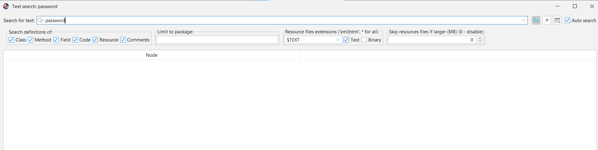

**Résultat :** Aucun résultat.  
**Niveau de risque :** ✅ Faible — RAS.

---

## Task 5 — Conversion DEX → JAR

### 5.1 — Extraction du fichier DEX

**Commandes :**
```
PS C:\APK-Analysis> mkdir C:\APK-Analysis\dex_out
PS C:\APK-Analysis> $zip = [System.IO.Compression.ZipFile]::OpenRead("C:\APK-Analysis\UnCrackable-Level1.apk")
PS C:\APK-Analysis> $zip.Entries | Where-Object { $_.Name -like "classes*.dex" } | ForEach-Object {
    [System.IO.Compression.ZipFileExtensions]::ExtractToFile($_, "C:\APK-Analysis\dex_out\$($_.Name)", $true)
}
PS C:\APK-Analysis> $zip.Dispose()
```
**Résultat :**
```
Mode          LastWriteTime   Length  Name
----          -------------   ------  ----
-a----  01/01/1980  00:00      5528  classes.dex
```
✅ 1 fichier DEX extrait (app simple, pas de multi-dex).

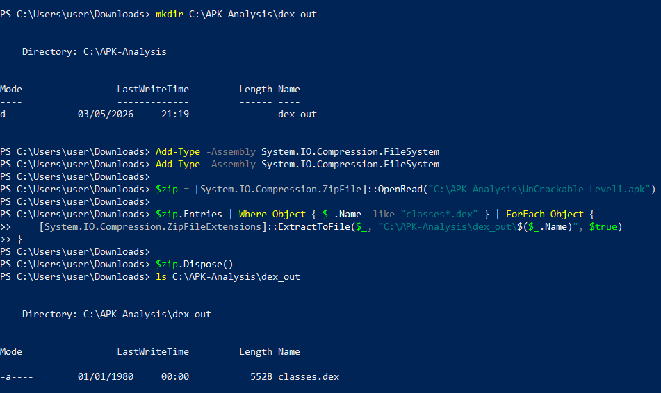

---

### 5.2 — Conversion DEX → JAR avec dex2jar

**Commande :**
```
PS C:\Users\user\Downloads\dex-tools-v2.4> .\d2j-dex2jar.bat "C:\APK-Analysis\dex_out\classes.dex" -o "C:\APK-Analysis\app.jar"
```
**Résultat :**
```
dex2jar C:\APK-Analysis\dex_out\classes.dex -> C:\APK-Analysis\app.jar
```
✅ Conversion réussie — `app.jar` généré.

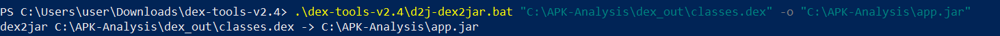

---

## Task 6 — Comparaison JADX vs JD-GUI

### JADX — classe `sg.vantagepoint.uncrackable1.a`

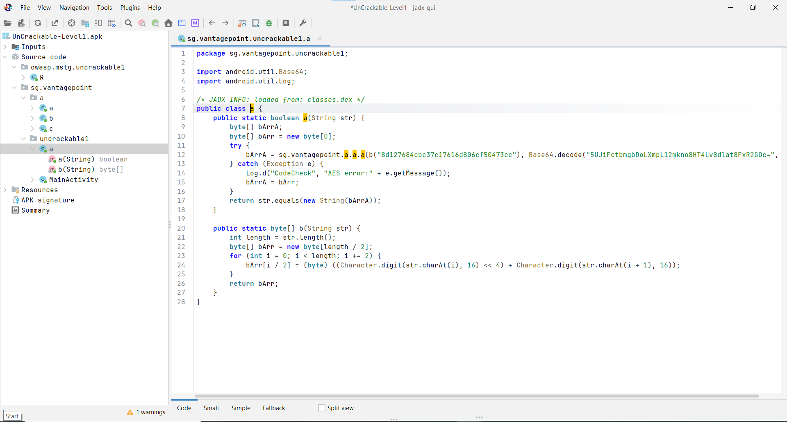

### JD-GUI — même classe depuis app.jar

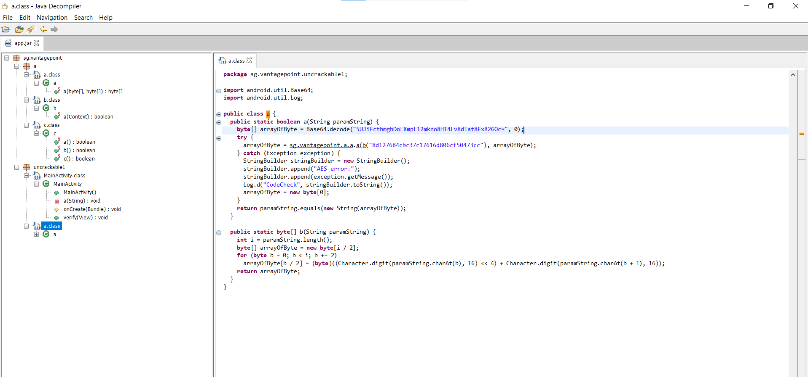

### Nettoyage results

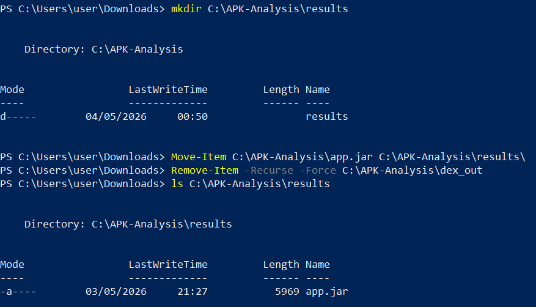

### Tableau comparatif

| Aspect | JADX GUI v1.5.5 | JD-GUI v1.6.6 |
|--------|-----------------|----------------|
| **Ressources Android** | ✅ AndroidManifest, strings.xml, res/ | ❌ Uniquement code Java |
| **Navigation** | Structure Android complète | Structure JAR/Java uniquement |
| **Lisibilité du code** | Meilleure reconstruction | Parfois moins lisible |
| **Input** | Ouvre directement l'APK | Nécessite un JAR (dex2jar) |
| **Obfuscation** | Tente de reconstruire les noms | Conserve les noms obfusqués |

**Conclusion :** JADX est plus adapté pour l'analyse Android. JD-GUI est utile en complément pour valider la décompilation Java.

---

## Constats de Sécurité

### Constat #1 — Clé AES codée en dur
**Sévérité :** 🔴 Élevée  
**Description :** La clé AES et les données chiffrées sont présentes en clair dans le bytecode.  
**Localisation :** `sg.vantagepoint.uncrackable1.a.a(String)`  
```java
b("8d127684cbc37c17616d806cf50473cc")  // clé AES hardcodée
Base64.decode("5UJiFctbmgbDoLXmpL12mkno8HT4Lv8dlat8FxR2GOc=", 0)  // données hardcodées
```
**Impact potentiel :** Extraction du secret sans exécuter l'application.  
**Remédiation :** Utiliser Android Keystore ou un serveur d'authentification.

---

### Constat #2 — Algorithme AES/ECB (mode faible)
**Sévérité :** 🔴 Élevée  
**Description :** AES en mode ECB sans IV — données identiques = chiffré identique.  
**Localisation :** `sg.vantagepoint.a.a.a(byte[], byte[])`  
```java
SecretKeySpec secretKeySpec = new SecretKeySpec(bArr, "AES/ECB/PKCS7Padding");
```
**Impact potentiel :** Vulnérable aux attaques par analyse de patterns et par rejeu.  
**Remédiation :** Utiliser AES/GCM avec un IV aléatoire.

---

### Constat #3 — android:allowBackup="true"
**Sévérité :** 🔴 Élevée  
**Description :** Permet d'extraire toutes les données privées via `adb backup` sans root.  
**Localisation :** `AndroidManifest.xml` → `<application>`  
**Impact potentiel :** `adb backup -noapk owasp.mstg.uncrackable1` vole toutes les données.  
**Remédiation :** `android:allowBackup="false"` en production.

---

### Constat #4 — minSdkVersion trop ancien (API 19)
**Sévérité :** ⚠️ Moyenne  
**Description :** Supporte Android 4.4 qui contient de nombreuses vulnérabilités non corrigées.  
**Localisation :** `AndroidManifest.xml` → `<uses-sdk android:minSdkVersion="19"/>`  
**Impact potentiel :** Exposition aux vulnérabilités connues d'Android 4.4.  
**Remédiation :** Augmenter `minSdkVersion` à 26 minimum (Android 8.0).

---

### Constat #5 — Détection de root contournable
**Sévérité :** ⚠️ Moyenne  
**Description :** Les 3 méthodes de détection root sont basées sur des vérifications statiques facilement bypassables avec Frida ou Magisk Hide.  
**Localisation :** `sg.vantagepoint.a.c` — méthodes `a()`, `b()`, `c()`  
**Impact potentiel :** Contournement de la protection sur appareil rooté.  
**Remédiation :** Utiliser Google Play Integrity API.

---

## Annexes

### Permissions demandées
Aucune permission déclarée.

### Composants exportés
| Composant | Type | Exported | Raison |
|-----------|------|----------|--------|
| `sg.vantagepoint.uncrackable1.MainActivity` | Activity | Implicitement via intent-filter | Point d'entrée de l'application |

---

## Ressources
- OWASP MSTG Crackmes : https://mas.owasp.org/crackmes/
- JADX : https://github.com/skylot/jadx
- dex2jar : https://github.com/pxb1988/dex2jar
- JD-GUI : https://github.com/java-decompiler/jd-gui
- OWASP MASVS : https://mas.owasp.org/MASVS/

---

*Analyse réalisée dans un cadre pédagogique — APK OWASP Crackme — données fictives*
